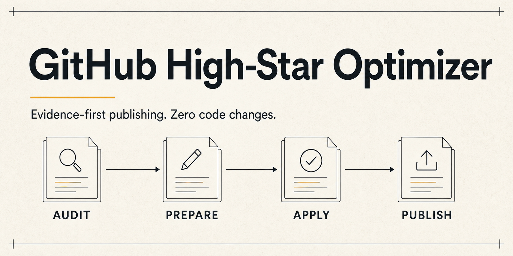

# GitHub High-Star Optimizer

[English](README.md) · [简体中文](README.zh-CN.md) · [繁體中文](README.zh-TW.md) · [日本語](README.ja.md) · [한국어](README.ko.md) · [Español](README.es.md) · [Português (Brasil)](README.pt-BR.md) · [Français](README.fr.md) · [Deutsch](README.de.md) · [Italiano](README.it.md) · [Русский](README.ru.md) · [العربية](README.ar.md) · [हिन्दी](README.hi.md) · [Türkçe](README.tr.md) · [Bahasa Indonesia](README.id.md)

<p align="center">
  
</p>

> Agent Skills standardını izleyen; Codex, Claude Code ve uyumlu ana bilgisayarlarda çalışan taşınabilir bir Skill. Gerçek ve mevcut bir GitHub projesini ürün kodunu değiştirmeden daha açık, güvenilir ve yayına hazır bir depoya dönüştürür.

GitHub High-Star Optimizer yalnızca herkese açık sunum ve yayın katmanını iyileştirir: konumlandırma, README yapısı, kanıta dayalı görseller, depo meta verileri, Release Notes, yerelleştirilmiş tanıtımlar ve etik lansman materyalleri. Star sayısı vaat etmez ve etkileşimi manipüle etmez.

> Kanonik kaynak [İngilizce README](README.md) dosyasıdır. Bu çeviri henüz ana dili konuşan biri tarafından incelenmedi; fark varsa İngilizce sürümü esas alın.

## Neleri iyileştirir

- **Ad ve arama:** görev terimi uyumu, güncel GitHub arama örnekleri, ad çakışmaları, meta veri hizalaması ve yeniden adlandırma maliyetini değerlendirir.
- **Açıklık:** hedef kitle, sorun, sonuç, fark ve sonraki eylem.
- **Güven:** depo kanıtlarına bağlı iddialar, açık sınırlamalar ve gerçek sonuçlar.
- **Sunum:** README Hero, Social Preview, Release görseli, rozetler ve bilgi hiyerarşisi.
- **Dağıtım:** meta veriler, Release Notes, yerelleştirilmiş metinler ve ölçülebilir yayın sırası.
- **Sınırlar:** kaynak kod, bağımlılıklar, derleme, testler, CI, çalışma zamanı yapılandırması veya ürün davranışı değiştirilmez.

## Dört mod

| Mod | İşlev | Değişiklik |
|---|---|---|
| **Audit** | Herkese açık yüzeyi değerlendirir ve eksikleri önceliklendirir. | Yok |
| **Prepare** | Metinleri ve varlıkları ayrı bir dizinde hazırlar. | Yok |
| **Apply** | Yalnızca açıkça onaylanan kod dışı dosyaları uygular. | Sadece onaylı liste |
| **Publish** | Yetkilendirmeden sonra meta verileri, Releases veya dış yayın yüzeylerini günceller. | Sadece yetkili eylemler |

## Hızlı başlangıç

1. Bu depoyu klonlayın.
2. [Kurulum kılavuzunu](docs/INSTALLATION.md) izleyerek içteki [`github-high-star-optimizer`](github-high-star-optimizer) dizinini Codex, Claude Code veya uyumlu bir Agent Skills ana bilgisayarına kurun.
3. Ana bilgisayarın çağırma sözdizimini kullanarak gerçek bir depo veya çalışma alanı belirtin.

```text
Use $github-high-star-optimizer to audit this existing repository.
Only optimize its public presentation and release package; do not change code.
```

## Doğruluk kuralları

Her önemli iddia depo dosyalarına, Releases, demolara, Issues, kullanıcı tarafından sağlanan gerçeklere veya açıkça işaretlenmiş çıkarımlara dayanmalıdır. Üretilen görseller ürün arayüzü, komut çıktısı, ölçüm, entegrasyon, müşteri, özellik veya Star sayısı uyduramaz. Star satın alma ya da takası, otomatik etkileşim ve koşullu ödüller yasaktır.

Tam iş akışı [`github-high-star-optimizer/SKILL.md`](github-high-star-optimizer/SKILL.md), çok dilli kurallar [`multilingual-publishing.md`](github-high-star-optimizer/references/multilingual-publishing.md) içindedir.

## Lisans

[MIT](LICENSE)
